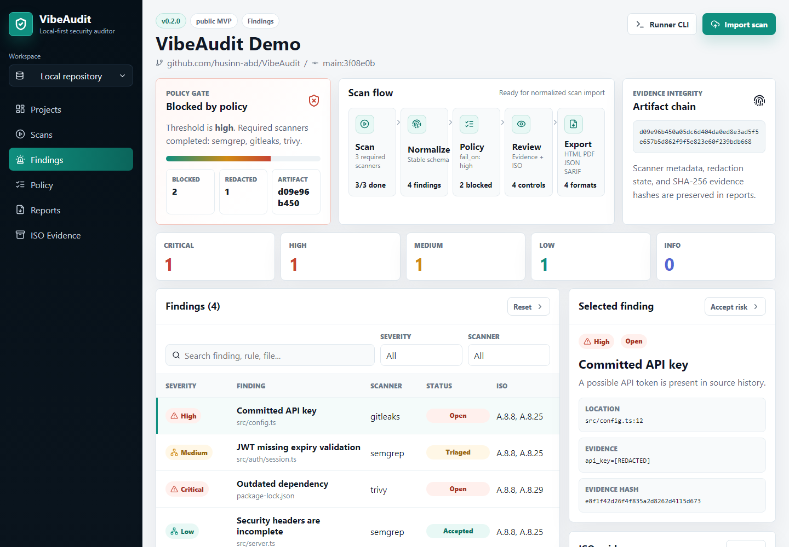

# VibeAudit

[](https://github.com/husinn-abd/VibeAudit/actions/workflows/ci.yml)
[](https://github.com/husinn-abd/VibeAudit/actions/workflows/pages.yml)
[](./CHANGELOG.md)
[](./LICENSE)
[](https://husinn-abd.github.io/VibeAudit/)

VibeAudit is a local-first security audit cockpit for modern repositories. It
helps developers and auditors scan code, normalize findings, enforce policy
gates, preserve evidence hashes, and prepare ISO/IEC 27001 audit support without
uploading source code by default.

[Open the live dashboard](https://husinn-abd.github.io/VibeAudit/) |
[Read the implementation phases](./docs/IMPLEMENTATION_PHASES.md) |
[Review the VibeAudit standard](./docs/VIBEAUDIT_STANDARD.md) |
[See the changelog](./CHANGELOG.md) |
[Review the security policy](./SECURITY.md)



Screenshot captured from the real `apps/web` dashboard running locally. The
sample data is seeded demo data, but the interface, selection state, policy
panel, evidence panel, and report controls are rendered by the application.

## Why VibeAudit

Security scanners are useful, but their output is often scattered across CLI
logs, SARIF uploads, CI failures, PDF reports, and spreadsheet-based risk
registers. VibeAudit turns those signals into one reviewable workflow:

- Run Semgrep, Gitleaks, and Trivy from a local runner.
- Normalize findings into one stable model.
- Redact secrets before storage, reports, or AI.
- Apply a policy gate that can fail CI.
- Track evidence hashes, scanner metadata, and ISO control mappings.
- Export developer, executive, JSON, SARIF, and evidence-oriented reports.

## Who It Helps

- Developers who want a fast local security check before pushing.
- Security teams that need consistent evidence across projects.
- Auditors who need traceable scanner metadata and control mapping.
- Open-source maintainers who want a readable public security posture.
- AI-heavy teams that want assistance without sending full source by default.

## What Works Now

| Area | Status |
| --- | --- |
| Public dashboard | Deployed on GitHub Pages |
| Dashboard UI | Modern command-center interface with filters, selected evidence, scanner flow, ISO, and export state |
| Monorepo foundation | `apps/*`, `packages/*`, docs, CI, Pages workflow |
| Runner CLI | Mock scans, JSON output, SARIF output, Docker scanner wrappers |
| Core model | Severity mapping, fingerprints, policy evaluation, reports |
| Secret safety | Redaction, evidence hashing, API token hashing helpers |
| ISO-lite | A.8.8, A.8.25, A.8.28, A.8.29 support mappings |
| API | MVP import, projects, findings, risk acceptance, HTML report endpoint |

VibeAudit is pre-release. The dashboard currently uses demo data while the API
and persisted storage are being connected.

## Product Flow

1. **Scan locally** with the runner against a folder or git URL.
2. **Normalize** Semgrep, Gitleaks, and Trivy output into one finding model.
3. **Redact and hash** evidence before it is stored, shown, or exported.
4. **Evaluate policy** with `securerepo.policy.yml`, including `fail_on` and required scanners.
5. **Review in dashboard** with severity filters, scanner filters, selected finding evidence, scanner run metadata, and ISO-lite mappings.
6. **Accept risk or export** HTML, PDF, JSON, and SARIF reports from the same scan data.
7. **Fail CI when needed** using the runner exit code: `0` pass, `1` policy failed, `2` scanner/runtime error, `3` invalid input/config.

## Quickstart

Install dependencies, run tests, and build everything:

```bash
corepack pnpm install
corepack pnpm test
corepack pnpm build
```

Run the dashboard locally:

```bash
corepack pnpm --filter @vibeaudit/web dev
```

Open:

```text
http://localhost:5173
```

Run a deterministic mock scan:

```bash
corepack pnpm --filter @vibeaudit/runner scan:mock:demo
```

The demo writes `artifacts/mock-report.json` and `artifacts/mock-report.sarif`,
then exits `0` after confirming the expected policy failure.

For CI policy-gate behavior, use the raw command:

```bash
corepack pnpm --filter @vibeaudit/runner scan:mock
```

The raw mock scan intentionally returns exit code `1` because the sample policy
fails on high and critical findings.

## Real Scanner Mode

Real scanning uses Docker images for the required V1 scanner set:

- Semgrep for SAST.
- Gitleaks for committed secrets.
- Trivy for dependency and filesystem vulnerabilities.

```bash
corepack pnpm --filter @vibeaudit/runner exec tsx src/index.ts scan . \
  --output artifacts/vibeaudit-report.json \
  --sarif artifacts/vibeaudit-report.sarif
```

VibeAudit mounts local source read-only when running scanner containers.

## Policy Example

Create `securerepo.policy.yml`:

```yaml
schema_version: 1
required_scanners:
  - semgrep
  - gitleaks
  - trivy
fail_on: high
ignored_rules: []
accepted_risk_max_days: 90
ai_privacy_mode: disabled
```

Policy evaluation is deterministic and shared by the CLI, API imports, and
dashboard views.

## Architecture

```text
apps/
  api/       REST API, project scope, imports, findings, report endpoints
  runner/    Local CLI scanner orchestrator
  web/       Dashboard deployed to GitHub Pages
packages/
  core/      Finding schema, normalization, SARIF, policy engine, reports
  iso/       Lightweight ISO/IEC 27001 mappings
  security/  Redaction, hashing, token helpers, audit hash primitives
docs/
  Architecture, deployment, implementation phases, repo patterns, standards
```

The default import payload contains normalized findings, scanner metadata,
policy output, evidence hashes, and redacted snippets. Full source code is not
part of the default import contract.

API calls that read or write scoped data must include explicit organization
context through `x-organization-id`; project routes also carry `projectId` in the
path.

## Current Roadmap

1. Connect the dashboard to the API instead of demo data.
2. Persist imports through Prisma with SQLite for local use.
3. Add Postgres-ready deployment path.
4. Add HTML and PDF report generation from the same report model.
5. Add strict local AI assistance for finding explanations.
6. Add scanner benchmark fixtures for regression testing.

Deferred enterprise features include SSO, GitHub App, GitLab App, multi-runner
fleet, signed release pipeline, and full ISMS lifecycle workflows.

## Security And Compliance Notes

VibeAudit helps collect and organize technical evidence. It does not certify an
organization, replace an ISMS, or prove ISO/IEC 27001 compliance by itself.

Before using VibeAudit on sensitive repositories, read [SECURITY.md](./SECURITY.md).

## Contributing

Issues and pull requests are welcome. Keep changes scoped, update tests for
scanner or policy behavior, and never add real secrets to fixtures.

Start here:

- [Contribution guide](./CONTRIBUTING.md)
- [Architecture notes](./docs/ARCHITECTURE.md)
- [Deployment notes](./docs/DEPLOYMENT.md)
